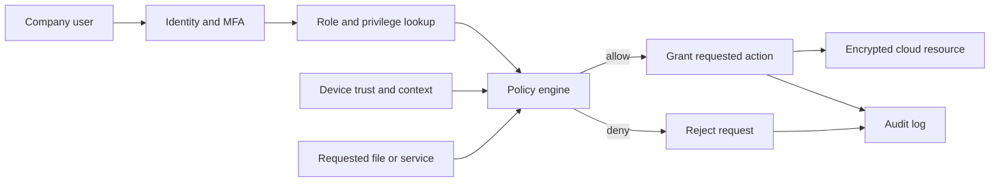

# Group Exercise – Model a Protected Cloud Service

## Chosen scenario

**Protected cloud service with multiple privilege levels for company users.**

The real-world problem is how a company can store and share information in the cloud while ensuring that each user receives only the access required for their job.

## System representation

The system is modeled as:

$$
S = (X, R, f, Y, C)
$$

where:

- **X**: inputs and objects;
- **R**: relationships between users, roles, resources, and permissions;
- **f**: the transformation that evaluates an access request;
- **Y**: the access decision produced by the system; and
- **C**: security, organizational, and technical constraints.

## Mathematical objects

### Inputs and objects: X

For an access request, define

$$
x_i = (u_i, r_i, d_i, a_i, t_i, q_i)
$$

where $u_i$ is the user, $r_i$ is the user's role, $d_i$ is the requested resource, $a_i$ is the requested action, $t_i$ is the device and authentication state, and $q_i$ is the request context.

The objects include users, groups, roles, files, databases, devices, authentication tokens, policies, and audit records.

### Relationships: R

Let the available actions be

$$
A=\{\text{read},\text{write},\text{download},\text{share}\}.
$$

Represent each action by one bit in a fixed order:

```text
(read, write, download, share)
```

For example, `1100` means `{read, write}` and `0010` means `{download}`.
Thus, a privilege set is represented by a four-bit mask in
$\{0,1\}^4$. The relationship set records which role may use which
privileges on which resource:

$$
R\subseteq U\times G\times D\times\{0,1\}^4.
$$

For an access request, each component supplies its own set of privileges:

$$
p_M,p_A,p_T,p_K,p_E\in\{0,1\}^4,
$$

where $p_M$ is the role-permission mask, $p_A$ is the authentication mask,
$p_T$ is the trusted-device mask, $p_K$ is the contextual-policy mask, and
$p_E$ is the resource-eligibility mask. A zero bit means that component does
not grant that action.

The requested action is also represented by a one-hot mask $q(a_i)$. For
example, $q(\text{read})=1000$ and $q(\text{download})=0010$.

For example, a relationship may state that Engineering has mask `1100` on a
project document, meaning that its members may read and write but may not
download or share it.

### Transformation: f

The access-control function evaluates the request against relationships and constraints:

```text
f(x_i, R, C) =
  allow, if the request is permitted
  deny,  if the request is denied
```

A request is permitted only when the requested bit survives every component's
privilege mask. The effective privilege mask is the bitwise AND

$$
p_{\mathrm{eff}}(x_i)=p_M\mathbin{\&}p_A\mathbin{\&}p_T\mathbin{\&}p_K\mathbin{\&}p_E.
$$

The access function is therefore

$$
f(x_i,R,C)=
\begin{cases}
\text{allow}, & (p_{\mathrm{eff}}(x_i)\mathbin{\&}q(a_i))=q(a_i),\\
\text{deny}, & \text{otherwise}.
\end{cases}
$$

This is a bitwise AND, not a logical AND. It guarantees that every requested
privilege is granted by every component.

### Output/decision: Y

The output is an access decision:

$$
y_i \in \{\text{allow},\ \text{deny}\}.
$$

An approval or step-up process can change one of the component masks, after
which the same bitwise rule is evaluated again.

### Constraints: C

The model must satisfy least privilege, default deny, separation of duties, multi-factor authentication for privileged actions, encryption in transit and at rest, time-limited temporary access, complete audit logging, immediate account revocation, and applicable privacy and company-policy requirements.

## Answers to the group questions

### 1. What real-world problem are you modeling?

We are modeling secure company access to cloud files and applications. The company needs collaboration, but unauthorized users must not view, change, download, or share protected information.

### 2. What mathematical objects are required?

The model requires sets of users $U$, roles $G$, permissions $P$, resources $D$, actions $A$, authentication states, risk contexts, relationships $R$, constraints $C$, and an access function $f$.

### 3. What information is represented?

The model represents who requests access, the user's privilege level, the requested resource and action, authentication state, device trust, contextual risk, approval status, and the final decision.

### 4. What information is omitted?

The simplified model omits detailed file contents, the complete cloud-provider implementation, human behavior, individual password quality, and every legal or business exception. Risk and device trust are summarized rather than modeled signal by signal.

### 5. What transformation is performed?

The function $f$ represents each component's privileges as a bit mask, computes their bitwise AND, and checks whether the requested-action bit remains set. It transforms the request into an allow or deny decision.

### 6. What decision is produced?

The system decides whether the user may perform the requested action. An approval or step-up authentication process may update a component's privilege mask, after which the same allow/deny rule is applied again.

### 7. What assumptions are required?

We assume that roles and permissions are correctly configured, user identities are unique, authentication results are trustworthy, audit logs cannot be altered by ordinary users, data owners classify resources correctly, and administrators follow company procedures.

### 8. Where does uncertainty appear?

Uncertainty appears in stolen credentials, inaccurate device-risk information, incomplete data classification, changing user responsibilities, unknown attacks, mistaken permissions, and the possibility that a legitimate user may behave maliciously.

### 9. Could an attacker manipulate the input or model?

Yes. An attacker could steal a session token, impersonate a user, compromise a device, change group membership, exploit a policy error, or manipulate contextual signals. Furthermore, a defect at the kernel level may allow privilege-escalation exploits if the attacker gains access to the internal system.

### 10. How would you test whether the model is useful?

We would create test cases for every role and data classification, including valid access, invalid access, expired access, compromised accounts, unmanaged devices, and emergency access. We would measure false allows, false denies, response time, audit completeness, and whether revoked users lose access immediately.

## System diagram



## Worked example

Alice is a basic employee in Engineering and requests to read an Engineering
project document. In the input tuple,

$$
x_i=(\text{Alice},\text{Engineering},\text{project document},
\text{read},\text{MFA + managed device},\text{normal context}).
$$

Use the bit order
`(read, write, download, share)`. The request mask is

$$
q(\text{read})=1000.
$$

Each component gives the request the following privilege set:

$$
p_M=1100,\quad p_A=1111,\quad p_T=1110,\quad
p_K=1110,\quad p_E=1100.
$$

These masks mean that Alice's Engineering role permits reading and writing,
MFA permits all four actions, the managed device and normal context permit
reading, writing, and downloading, and the project document is eligible for
reading and writing. The effective privileges are computed by bitwise AND:

$$
p_{\mathrm{eff}}=1100\mathbin{\&}1111\mathbin{\&}1110\mathbin{\&}1110
\mathbin{\&}1100=1100.
$$

Because the requested read bit is present,

$$
(p_{\mathrm{eff}}\mathbin{\&}q(\text{read}))
=1100\mathbin{\&}1000=1000=q(\text{read}),
$$

the model returns **allow**.

Now consider the same user's request to download a highly restricted HR
database. Its request mask is $q(\text{download})=0010$. The role and resource
components do not grant that privilege:

$$
p_M=1100,\qquad p_E=0000.
$$

Therefore, the effective mask has no download bit, regardless of the other
components:

$$
p_{\mathrm{eff}}\mathbin{\&}q(\text{download})
=(1100\mathbin{\&}1111\mathbin{\&}1110\mathbin{\&}1110\mathbin{\&}0000)
\mathbin{\&}0010=0000\neq0010.
$$

The model consequently returns **deny**. Both outcomes are parts of one
example: access is allowed only when the requested action bit is present in
the privilege set of every component.

## Conclusion

This model represents a protected cloud service as inputs, relationships, a transformation, outputs, and constraints. Multiple privilege levels make access more precise, while authentication, context, approval, encryption, and logging provide additional protection around the cloud service.
