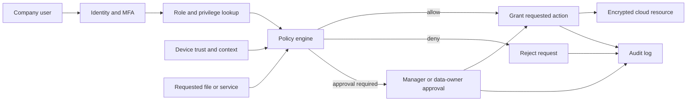

# Group Exercise – Model a Protected Cloud Service

## Chosen scenario

**Protected cloud service with multiple privilege levels for company users.**

The real-world problem is how a company can store and share information in the cloud while ensuring that each user receives only the access required for their job.

## System representation

The system is modeled as:

\[
S = (X, R, f, Y, C)
\]

where:

- **X**: inputs and objects;
- **R**: relationships between users, roles, resources, and permissions;
- **f**: the transformation that evaluates an access request;
- **Y**: the access decision produced by the system; and
- **C**: security, organizational, and technical constraints.

## Mathematical objects

### Inputs and objects: X

For an access request, define

\[
x_i = (u_i, r_i, d_i, a_i, t_i, q_i)
\]

where \(u_i\) is the user, \(r_i\) is the user's role, \(d_i\) is the requested resource, \(a_i\) is the requested action, \(t_i\) is the device and authentication state, and \(q_i\) is the request context.

The objects include users, groups, roles, files, databases, devices, authentication tokens, policies, and audit records.

### Relationships: R

The relationships can be represented as:

\[
R \subseteq U \times G \times P \times D
\]

where \(U\) is the set of users, \(G\) the set of groups or roles, \(P\) the set of permissions, and \(D\) the set of data resources.

Examples include an employee belonging to Engineering, Engineering being allowed to read a project folder, a manager approving temporary permission, and an auditor inspecting logs without changing business data.

### Transformation: f

The access-control function evaluates the request against relationships and constraints:

\[
f(x_i, R, C) =
\begin{cases}
1, & \text{if the request is permitted},\\
0, & \text{if the request is denied}.
\end{cases}
\]

A request is permitted only when all required conditions are true:

\[
f(x_i,R,C)=1 \iff M(u_i,d_i,a_i) \land A(u_i) \land T(t_i) \land K(q_i) \land E(d_i)
\]

Here, \(M\) checks the role permission, \(A\) checks authentication, \(T\) checks device trust, \(K\) checks contextual policy, and \(E\) checks whether the data is eligible for the requested action.

### Output/decision: Y

The output is an access decision:

\[
y_i \in \{\text{allow},\ \text{deny},\ \text{allow with approval}\}
\]

Reading a normal team document may produce **allow**, downloading a restricted database may produce **allow with approval**, and accessing HR records without the HR role may produce **deny**.

### Constraints: C

The model must satisfy least privilege, default deny, separation of duties, multi-factor authentication for privileged actions, encryption in transit and at rest, time-limited temporary access, complete audit logging, immediate account revocation, and applicable privacy and company-policy requirements.

## Answers to the group questions

### 1. What real-world problem are you modeling?

We are modeling secure company access to cloud files and applications. The company needs collaboration, but unauthorized users must not view, change, download, or share protected information.

### 2. What mathematical objects are required?

The model requires sets of users \(U\), roles \(G\), permissions \(P\), resources \(D\), actions \(A\), authentication states, risk contexts, relationships \(R\), constraints \(C\), and an access function \(f\).

### 3. What information is represented?

The model represents who requests access, the user's privilege level, the requested resource and action, authentication state, device trust, contextual risk, approval status, and the final decision.

### 4. What information is omitted?

The simplified model omits detailed file contents, the complete cloud-provider implementation, human behavior, individual password quality, and every legal or business exception. Risk and device trust are summarized rather than modeled signal by signal.

### 5. What transformation is performed?

The function \(f\) compares the request with role permissions, authentication requirements, device conditions, context, data classification, and approval rules. It transforms those inputs into an allow, deny, or approval-required decision.

### 6. What decision is produced?

The system decides whether the user may perform the requested action. It may also require additional approval, step-up authentication, or a shorter access period before allowing a sensitive action.

### 7. What assumptions are required?

We assume that roles and permissions are correctly configured, user identities are unique, authentication results are trustworthy, audit logs cannot be altered by ordinary users, data owners classify resources correctly, and administrators follow company procedures.

### 8. Where does uncertainty appear?

Uncertainty appears in stolen credentials, inaccurate device-risk information, incomplete data classification, changing user responsibilities, unknown attacks, mistaken permissions, and the possibility that a legitimate user may behave maliciously.

### 9. Could an attacker manipulate the input or model?

Yes. An attacker could steal a session token, impersonate a user, compromise a device, change group membership, exploit a policy error, or manipulate contextual signals. Furthermore,
a defect at the kernel level may allow priviledge escalation exploits to be executed if the attacker has access to the internal system.

### 10. How would you test whether the model is useful?

We would create test cases for every role and data classification, including valid access, invalid access, expired access, compromised accounts, unmanaged devices, and emergency access. We would measure false allows, false denies, response time, audit completeness, and whether revoked users lose access immediately.

## System diagram

## Worked example

Alice is a basic employee in Engineering and requests to read an Engineering project document. She has valid multi-factor authentication and uses a managed device. If the document is shared with Engineering, then:

\[
M(\text{Alice},\text{document},\text{read})=1,\quad A=1,\quad T=1,\quad K=1,\quad E=1
\]

Therefore:

\[
f(x_i,R,C)=1 \quad \Rightarrow \quad y_i=\text{allow}.
\]

If Alice requests to download a highly restricted HR database, the role-permission condition is false:

\[
M(\text{Alice},\text{HR database},\text{download})=0
\]

so the system returns **deny**, even if her password and multi-factor authentication are valid.

## Conclusion

This model represents a protected cloud service as inputs, relationships, a transformation, outputs, and constraints. Multiple privilege levels make access more precise, while authentication, context, approval, encryption, and logging provide additional protection around the cloud service.
