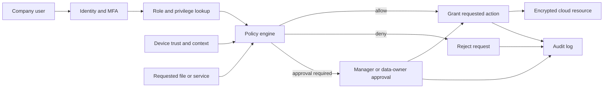

# Group Exercise – Model a Protected Cloud Service

## Chosen scenario

**Protected cloud service with multiple privilege levels for company users.**

The real-world problem is how a company can store and share information in the cloud while ensuring that each user receives only the access required for their job.

## System representation

The system is modeled as:

$$
S = (X, R, f, Y, C)
$$

where:

- **X**: inputs and objects;
- **R**: relationships between users, roles, resources, and permissions;
- **f**: the transformation that evaluates an access request;
- **Y**: the access decision produced by the system; and
- **C**: security, organizational, and technical constraints.

## Mathematical objects

### Inputs and objects: X

For an access request, define

$$
x_i = (u_i, r_i, d_i, a_i, t_i, q_i)
$$

where $u_i$ is the user, $r_i$ is the user's role, $d_i$ is the requested resource, $a_i$ is the requested action, $t_i$ is the device and authentication state, and $q_i$ is the request context.

The objects include users, groups, roles, files, databases, devices, authentication tokens, policies, and audit records.

### Relationships: R

The relationships can be represented as:

```text
R = U × G × P × D
```

Here, `×` means a Cartesian product. Each relationship is a tuple
`(u, g, p, d)` containing one element from each set:

- `U`: user identifiers;
- `G`: groups or roles;
- `P`: permissions or actions; and
- `D`: data resources.

To store the tuple as one fixed-width bit string, assign each set a separate,
non-overlapping bit field:

```text
U = {0, 1}^bU
G = {0, 1}^bG
P = {0, 1}^bP
D = {0, 1}^bD

encode(u, g, p, d) = u || g || p || d
```

The fields occupy different bit positions, so the encoding is unambiguous:

```text
| user bits (bU) | group bits (bG) | permission bits (bP) | data bits (bD) |
```

Thus, the total relationship length is
`bU + bG + bP + bD` bits. The `^` in `{0, 1}^bU` denotes a set of bit
strings of length `bU`; it does not mean bitwise XOR.

Examples include an employee belonging to Engineering, Engineering being allowed to read a project folder, a manager approving temporary permission, and an auditor inspecting logs without changing business data.

### Transformation: f

The access-control function evaluates the request against relationships and constraints:

```text
f(x_i, R, C) =
  allow, if the request is permitted
  deny,  if the request is denied
```

A request is permitted only when all required conditions are true:

```text
f(x_i, R, C) = allow if and only if
M(u_i, d_i, a_i) AND A(u_i) AND T(t_i) AND K(q_i) AND E(d_i)
```

Here, $M$ checks the role permission, $A$ checks authentication, $T$ checks device trust, $K$ checks contextual policy, and $E$ checks whether the data is eligible for the requested action.

### Output/decision: Y

The output is an access decision:

$$
y_i \in \{\text{allow},\ \text{deny},\ \text{allow with approval}\}
$$

Reading a normal team document may produce **allow**, downloading a restricted database may produce **allow with approval**, and accessing HR records without the HR role may produce **deny**.

### Constraints: C

The model must satisfy least privilege, default deny, separation of duties, multi-factor authentication for privileged actions, encryption in transit and at rest, time-limited temporary access, complete audit logging, immediate account revocation, and applicable privacy and company-policy requirements.

## Answers to the group questions

### 1. What real-world problem are you modeling?

We are modeling secure company access to cloud files and applications. The company needs collaboration, but unauthorized users must not view, change, download, or share protected information.

### 2. What mathematical objects are required?

The model requires sets of users $U$, roles $G$, permissions $P$, resources $D$, actions $A$, authentication states, risk contexts, relationships $R$, constraints $C$, and an access function $f$.

### 3. What information is represented?

The model represents who requests access, the user's privilege level, the requested resource and action, authentication state, device trust, contextual risk, approval status, and the final decision.

### 4. What information is omitted?

The simplified model omits detailed file contents, the complete cloud-provider implementation, human behavior, individual password quality, and every legal or business exception. Risk and device trust are summarized rather than modeled signal by signal.

### 5. What transformation is performed?

The function $f$ compares the request with role permissions, authentication requirements, device conditions, context, data classification, and approval rules. It transforms those inputs into an allow, deny, or approval-required decision.

### 6. What decision is produced?

The system decides whether the user may perform the requested action. It may also require additional approval, step-up authentication, or a shorter access period before allowing a sensitive action.

### 7. What assumptions are required?

We assume that roles and permissions are correctly configured, user identities are unique, authentication results are trustworthy, audit logs cannot be altered by ordinary users, data owners classify resources correctly, and administrators follow company procedures.

### 8. Where does uncertainty appear?

Uncertainty appears in stolen credentials, inaccurate device-risk information, incomplete data classification, changing user responsibilities, unknown attacks, mistaken permissions, and the possibility that a legitimate user may behave maliciously.

### 9. Could an attacker manipulate the input or model?

Yes. An attacker could steal a session token, impersonate a user, compromise a device, change group membership, exploit a policy error, or manipulate contextual signals. Furthermore, a defect at the kernel level may allow privilege-escalation exploits if the attacker gains access to the internal system.

### 10. How would you test whether the model is useful?

We would create test cases for every role and data classification, including valid access, invalid access, expired access, compromised accounts, unmanaged devices, and emergency access. We would measure false allows, false denies, response time, audit completeness, and whether revoked users lose access immediately.

## System diagram



## Worked example

Alice is a basic employee in Engineering and requests to read an Engineering project document. She has valid multi-factor authentication and uses a managed device. If the document is shared with Engineering, then:

$$
M(\text{Alice},\text{document},\text{read})=1,\quad A=1,\quad T=1,\quad K=1,\quad E=1
$$

Therefore:

$$
f(x_i,R,C)=1 \quad \Rightarrow \quad y_i=\text{allow}.
$$

If Alice requests to download a highly restricted HR database, the role-permission condition is false:

$$
M(\text{Alice},\text{HR database},\text{download})=0
$$

so the system returns **deny**, even if her password and multi-factor authentication are valid.

## Additional worked mathematical example: Alice's cloud access request

This example applies the model directly to the protected cloud service. Alice
is an employee in Engineering and requests to read an Engineering project
document from a managed device. Represent the request as

$$
x_i=(u_i,r_i,d_i,a_i,t_i,q_i)
$$

with

$$
x_i=(\text{Alice},\text{Engineering},\text{project document},
\text{read},\text{MFA + managed device},\text{normal context}).
$$

For the normal context, suppose the risk inputs are four failed logins, a new
device indicator of $1$, and a location-risk score of $0.7$. The risk score is

$$
r(q_i)=0.5(4)+2(1)+0.7=4.7.
$$

The policy requires the contextual risk score to be below $5$ for an ordinary
read request, so $K(q_i)=1$. The remaining model conditions are

$$
M(u_i,d_i,a_i)=1,\quad A(u_i)=1,\quad T(t_i)=1,\quad
K(q_i)=1,\quad E(d_i)=1.
$$

Therefore, the access transformation gives

$$
f(x_i,R,C)=
M\land A\land T\land K\land E
=1\land1\land1\land1\land1=1,
$$

so the output is

$$
y_i=\text{allow}.
$$

This example identifies the complete model: $x_i$ is the input request, $R$
supplies Alice's Engineering role and its read permission, $f$ checks the five
conditions, and $C$ supplies the risk threshold and least-privilege policy.

If Alice instead requests to download the highly restricted HR database, then

$$
M(\text{Alice},\text{HR database},\text{download})=0.
$$

Consequently, even with valid MFA and a trusted device,

$$
f(x_i,R,C)=0\quad\Rightarrow\quad y_i=\text{deny}.
$$

The model is mathematically consistent, but it is still an approximation. A
wrong role assignment, inaccurate risk score, or compromised device could
produce a false allow or false deny. The model should therefore be tested with
labelled access requests, including revoked users, unmanaged devices, and
misclassified resources. This follows the PDF's distinction between a correct
calculation and a valid real-world decision.

## Conclusion

This model represents a protected cloud service as inputs, relationships, a transformation, outputs, and constraints. Multiple privilege levels make access more precise, while authentication, context, approval, encryption, and logging provide additional protection around the cloud service.
