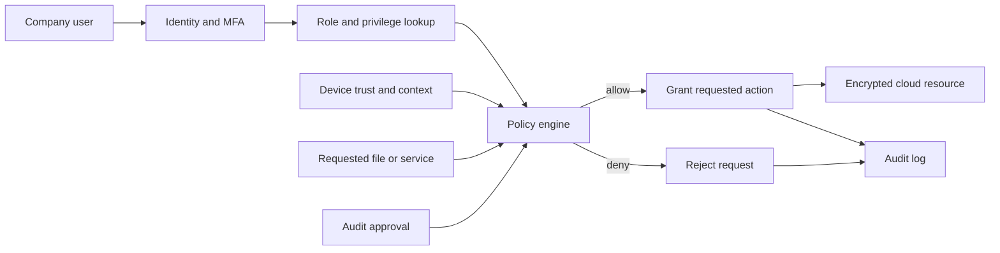

# Group Exercise – Model a Protected Cloud Service

## Chosen scenario

**Protected cloud service with multiple privilege levels for company users.**

The real-world problem is how a company can store and share information in the cloud while ensuring that each user receives only the access required for their job.

## System representation

The system is modeled as:

```text
S = (X, R, f, Y, C)
```

where:

- **X**: inputs and objects;
- **R**: relationships between users, roles, resources, and permissions;
- **f**: the transformation that evaluates an access request;
- **Y**: the access decision produced by the system; and
- **C**: security, organizational, and technical constraints.

## Mathematical objects

### Inputs and objects: X

For an access request, define

```text
x_i = (u_i, r_i, d_i, a_i, t_i, q_i)
```

where `u_i` is the user, `r_i` is the user's role, `d_i` is the requested resource, `a_i` is the requested action, `t_i` is the device and authentication state, and `q_i` is the request context.

The objects include users, groups, roles, files, databases, devices, authentication tokens, policies, and audit records.

### Relationships: R

Every permission is stored in one 64-bit unsigned integer (`uint64`). In
hexadecimal notation, `0x40` is 64 decimal, so the key has `0x40` bits. It is
divided into two `0x20`-bit fields; `0x20` is 32 decimal:

```text
bits 63..32: privilege level       bits 31..0: action permissions
```

The upper `0x20` bits represent the level at which a person may act. The lower
`0x20` bits represent the actions they may perform. The relationship set records
which role may use which 64-bit permission key on which resource:

```text
R ⊆ U × G × D × uint64
```

The level and action constants used in this model are:

```text
WORKER_LEVEL = 0x0000000100000000
BOSS_LEVEL   = 0x0000000300000000

READ         = 0x0000000000000001
WRITE        = 0x0000000000000002
DOWNLOAD     = 0x0000000000000004
SHARE        = 0x0000000000000008
APPROVE      = 0x0000000000000010
```

`BOSS_LEVEL` contains both the worker bit and the boss bit. Therefore, a boss
also has worker-level permission. For example, a worker who can read and
write has key `0x0000000100000003`, while a boss who can read, write, download,
and share has key `0x000000030000000F`.

Each component supplies its own 64-bit permission key. In this model the
components are role membership (`M`), authentication (`A`), trusted device
(`T`), context or policy (`K`), and resource eligibility (`E`). A zero bit in
any component removes that privilege from the ordinary decision.

### Transformation: f

The access-control function evaluates the request against relationships and constraints:

```text
f(x_i, R, C) =
  allow, if the request is permitted
  deny,  if the request is denied
```

A request key contains both the required level and the requested action. The
ordinary permission is the bitwise AND of every component key:

```text
base = M & A & T & K & E
```

An audit decision may grant a time-limited special permission. That permission
is ORed with the ordinary result:

```text
total = base | audit_grant
```

The final decision is:

```text
allow if (total & request) == request
deny  otherwise
```

Here `&` and `|` are bitwise AND and bitwise OR. The audit grant must contain
both the required level bit and the required action bit; it cannot bypass the
level check by granting only the action.

### Output/decision: Y

The output is an access decision:

```text
y_i ∈ {allow, deny}
```

An audit approval adds a temporary `audit_grant` to `total`; after expiry, that
grant becomes zero and the ordinary AND result applies again.

### Constraints: C

The model must satisfy least privilege, default deny, separation of duties, multi-factor authentication for privileged actions, encryption in transit and at rest, time-limited temporary access, complete audit logging, immediate account revocation, and applicable privacy and company-policy requirements.

## Answers to the group questions

### 1. What real-world problem are you modeling?

We are modeling secure company access to cloud files and applications. The company needs collaboration, but unauthorized users must not view, change, download, or share protected information.

### 2. What mathematical objects are required?

The model requires sets of users `U`, roles `G`, resources `D`, privilege levels, action permissions, 64-bit permission keys, authentication states, risk contexts, relationships `R`, constraints `C`, and an access function `f`.

### 3. What information is represented?

The model represents who requests access, the user's privilege level, the requested resource and action, authentication state, device trust, contextual risk, approval status, and the final decision.

### 4. What information is omitted?

The simplified model omits detailed file contents, the complete cloud-provider implementation, human behavior, individual password quality, and every legal or business exception. Risk and device trust are summarized rather than modeled signal by signal.

### 5. What transformation is performed?

The function `f` represents each component's privileges as a bit mask, computes their bitwise AND, and checks whether the requested-action bit remains set. It transforms the request into an allow or deny decision.

### 6. What decision is produced?

The system decides whether the user may perform the requested action. An audit approval contributes an `audit_grant`, which is ORed with the ordinary AND result before the same allow/deny rule is applied.

### 7. What assumptions are required?

We assume that roles and permissions are correctly configured, user identities are unique, authentication results are trustworthy, audit logs cannot be altered by ordinary users, data owners classify resources correctly, and administrators follow company procedures.

### 8. Where does uncertainty appear?

Uncertainty appears in stolen credentials, inaccurate device-risk information, incomplete data classification, changing user responsibilities, unknown attacks, mistaken permissions, and the possibility that a legitimate user may behave maliciously.

### 9. Could an attacker manipulate the input or model?

Yes. An attacker could steal a session token, impersonate a user, compromise a device, change group membership, exploit a policy error, or manipulate contextual signals. Furthermore, a defect at the kernel level may allow privilege-escalation exploits if the attacker gains access to the internal system.

### 10. How would you test whether the model is useful?

We would create test cases for every role and data classification, including valid access, invalid access, expired access, compromised accounts, unmanaged devices, and emergency access. We would measure false allows, false denies, response time, audit completeness, and whether revoked users lose access immediately.

## System diagram



## Worked example

Alice is a basic employee in Engineering and requests to read an Engineering
project document. In the input tuple,

```text
x_i = (Alice, Engineering, project document, read,
       MFA + managed device, normal context)
```

The request needs worker-level read permission:

```text
request = WORKER_LEVEL | READ
        = 0x0000000100000001
```

The component permission keys are:

```text
M = 0x0000000100000003  # Engineering worker: read + write
A = 0x00000003FFFFFFFF  # successful MFA
T = 0x0000000100000007  # managed device: read + write + download
K = 0x0000000100000007  # normal context
E = 0x0000000100000003  # project document: read + write
```

The ordinary permission is:

```text
base = M & A & T & K & E
     = 0x0000000100000003
audit_grant = 0x0000000000000000
total = base | audit_grant
      = 0x0000000100000003
```

The request is allowed because:

```text
(total & request) == request
(0x0000000100000003 & 0x0000000100000001)
    == 0x0000000100000001
```

Therefore, `y_i = allow`.

Now consider the same user's request to download a highly restricted HR
database. The request is still at worker level, but now asks for `DOWNLOAD`:

```text
request = WORKER_LEVEL | DOWNLOAD
        = 0x0000000100000004
```

The ordinary component keys for this restricted resource include:

```text
M = 0x0000000100000003  # Alice is still a worker
E = 0x0000000100000000  # HR resource grants no ordinary action
base = M & A & T & K & E
     = 0x0000000100000000
```

The ordinary result is denied because the download bit is not in `base`.
However, an auditor can grant a temporary special download permission at the
same worker level:

```text
audit_grant = 0x0000000100000004
total = base | audit_grant
      = 0x0000000100000004
```

Now the request is allowed because:

```text
(total & request) == request
(0x0000000100000004 & 0x0000000100000004)
    == 0x0000000100000004
```

After the audit grant expires, `audit_grant` returns to zero and the same
request is denied again. This single example demonstrates ordinary access,
denial, hierarchical boss/worker levels, and an audited special permission.

## Conclusion

This model represents a protected cloud service as inputs, relationships, a transformation, outputs, and constraints. Multiple privilege levels make access more precise, while authentication, context, approval, encryption, and logging provide additional protection around the cloud service.
